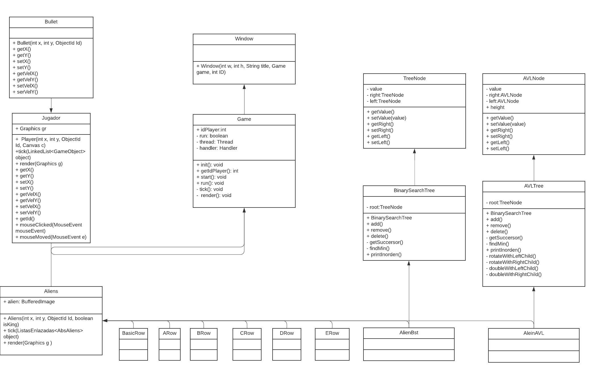
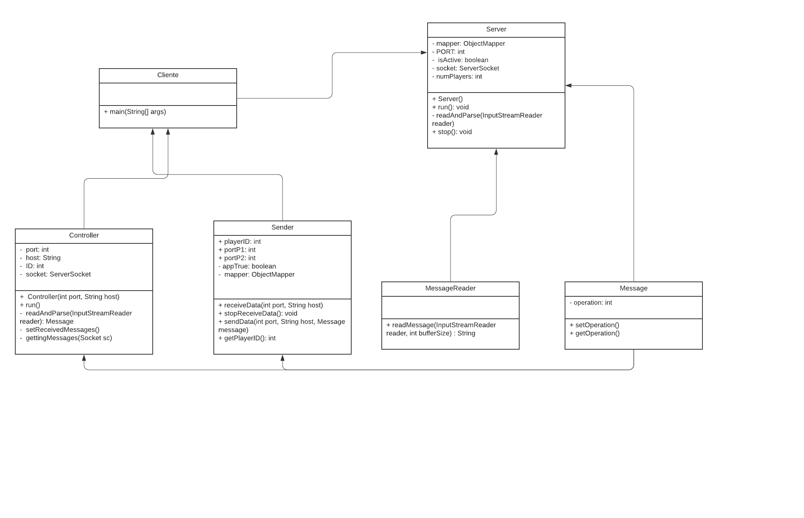

## Instituto Tecnológico de Costa Rica

## Integrantes del grupo:
* Aguero Barboza Marco
* Ramos Madrigal Jose Pablo

## Profesor
* Ing. Isaac Ramírez, M.SI.

## I Semestre 2021

## Descripción del problema
Basado en la versión 1.0 de Space Invaders, tenemos que desarrollar una versión multijugador de este juego usando lo que son conexiones de tipo TCP/IP que nos ofrece java.
Además, se tiene que crear una conexión de tipo servidor y cliente.
El servidor es un programa en Java separado de los programas clientes. Es decir, se deberá construir dos programas.
Cada jugador es una ejecución nueva del programa cliente.
El servidor recibe mensajes indicando las acciones que ha realizado cada jugador.
El servidor actualiza a los demás clientes enviándoles el evento realizado por un determinado jugador.
También en este proyecto se deben implementar dos nuevas clases de enemigos la cual una  está conformada por hileras la cuales están creadas a partir de árboles binarios de búsqueda y mientras tanto la otra esta conformada por la estructura de datos AVL. La hilera formada por árboles binarios de búsqueda deberá tener enemigos que tienen un identificador random que permite insertarlos en un árbol según dicho valor y visualmente se verá como un árbol BST.
Mientras tanto el árbol AVL no tiene forma visual de árbol solo es implementarlo con esa estructura.
Por último, cada jugador conectado, se verá en la pantalla de cada cliente. Cada movimiento que realice, deberá reflejarse en todos los clientes.

## Link a Jira
[Jira](https://algoritms-and-data-structures-project1.atlassian.net/jira/software/projects/PI/boards/5)
&nbsp;
[Backlog](https://algoritms-and-data-structures-project1.atlassian.net/jira/software/projects/PI/boards/5/backlog)

## Diseño

### Diagrama de clases 

### Diagrama del Servidor y Cliente

## Mejoras al proyecto
Primero se deshizo de la lógica de creación de filas de aliens, debido a que en el primer proyecto se tenían que instanciar  varias veces cada vez que se quería crear una nueva fila de aliens, por lo que se implanto el patrón de fábrica para los aliens, además los aliens heredan de una solo clase abstracta llamada AbsAliens. Además, para el control del juego se creo una clase encargada de esta llamada Handler que es la encargada de manejar los objetos del juego por ejemplo esta clase posee los métodos de eliminar enemigos, añadir enemigos, renderizar los enemigos, por lo tanto, Handler tiene la función de ser una fábrica de aliens.
Además, se mejoró en el movimiento del jugador para que fuera más estable y además se mejoro la lógica de disparo para que sea mas fluido y que no genere errores o bugs visuales a la hora de disparar la bala. También se implemento una clase abstracta para el jugador la cual se llama GameObject.
También para la mejora del proyecto original, se trató de tener separado todas la carpetas, clases y métodos con nombres significativos a la función que realizan, además se trató las carpetas de Server, Clientes, Core como si fuera proyecto independiente y creando dependencias entre proyectos mediante Gradle.
En resumen, gran parte del proyecto original fue cambiado para facilitar el funcionamiento de este, desde cambiar la forma de como los enemigos aparecen, la lógica de los jugadores, implementar el patrón de diseño fabrica, crear una clase que se encargue del control general del juego.
